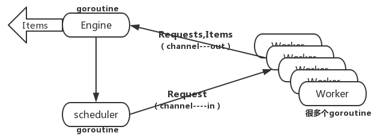
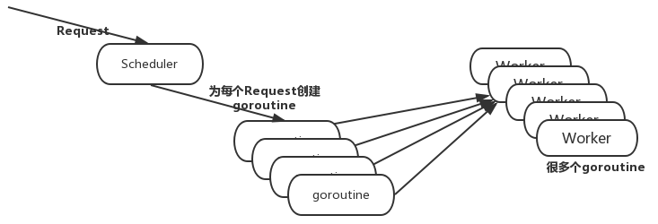
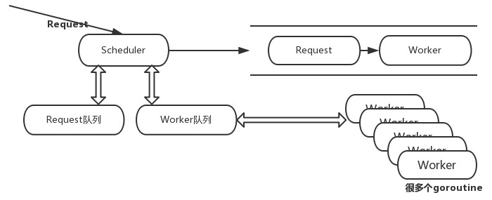

## go并发版爬虫

### 并发，并行，串行，同步，异步？

> 实际开发中很多人会因为并发，并行，串行，同步，异步等名词搞混，搞不清楚这些名称的意思和之间对应的关系。其实这也是实际开发中必须掌握一些知识点。掌握和理解这些概念也有助于我们去更好去开好。
   
- 并发编程又叫多线程编程。 在程序中，往往有很多很耗时的工作，比如上传文件、下载文件、跟客户聊天需要长时间建立连接。这种时候，一个线程是服务不了多个用户的，会产生因为资源独占产生的等待问题。并发的实质是一个物理CPU(也可以多个物理CPU) 在若干道程序之间多路复用，并发性是对有限物理资源强制行使多用户共享以提高效率。（买票问题并发进行） 并发当有多个线程在操作时,如果系统只有一个CPU,则它根本不可能真正同时进行一个以上的线程，它只能把CPU运行时间划分成若干个时间段,再将时间 段分配给各个线程执行，在一个时间段的线程代码运行时，其它线程处于挂起状。.这种方式我们称之为并发(Concurrent)。

- “并行”指两个或两个以上事件或活动在同一时刻发生。在多道程序环境下，并行性使多个程序同一时刻可在不同CPU上同时执行。（hadoop集群就是并行计算的）
     当系统有一个以上CPU时,则线程的操作有可能非并发。当一个CPU执行一个线程时，另一个CPU可以执行另一个线程，两个线程互不抢占CPU资源，可以同时进行，这种方式我们称之为并行(Parallel)。
并发和并行 
    并发和并行是即相似又有区别的两个概念，并行是指两个或者多个事件在同一时刻发生；而并发是指两个或多个事件在同一时间间隔内发生。在多道程序环境下，并发性是指在一段时间内宏观上有多个程序在同时运行，但在单处理机系统中，每一时刻却仅能有一道程序执行，故微观上这些程序只能是分时地交替执行。倘若在计算机系统中有多个处理机，则这些可以并发执行的程序便可被分配到多个处理机上，实现并行执行，即利用每个处理机来处理一个可并发执行的程序，这样，多个程序便可以同时执行。
- 串行、并行：
       并行和串行指的是任务的执行方式。串行是指多个任务时，各个任务按顺序执行，完成一个之后才能进行下一个。并行指的是多个任务可以同时执行，异步是多个任务并行的前提条件。
- 同步、异步：
         指的是能否开启新的线程。同步不能开启新的线程，异步可以。
         异步：异步和同步是相对的，同步就是顺序执行，执行完一个再执行下一个，需要等待、协调运行。异步就是彼此独立,在等待某事件的过程中继续做自己的事，不需要等待这一事件完成后再工作。线程就是实现异步的一个方式。异步是让调用方法的主线程不需要同步等待另一线程的完成，从而可以让主线程干其它的事情。
         异步和多线程并不是一个同等关系,异步是最终目的,多线程只是我们实现异步的一种手段。异步是当一个调用请求发送给被调用者,而调用者不用等待其结果的返回而可以做其它的事情。实现异步可以采用多线程技术或则交给另外的进程来处理。
- 多线程：多线程是程序设计的逻辑层概念，它是进程中并发运行的一段代码。多线程可以实现线程间的切换执行。


**你可以把并发理解是时间段，并行是时间点，举个栗子：一万个人在一分钟内去访问你这个网站的抢红包页面这就是并发，go语言的并发编程（假设你电脑是单核的,一个线程）就是协程，go语言可以开启多个协程去并发处理任务**

[漫话：如何给女朋友解释什么是并发和并行](https://juejin.im/post/5bdf0667e51d450b267fe3e3)


## go并发爬虫项目介绍

### Scheduler实现一、架构图：




### worker: Fether和Parser，把worker并发
```go
func worker(r Request) (ParseResult,error){
	body,err :=fetch.Fetcher(r.Url)
	fmt.Printf("我正在爬取这个地址Fetching %s\n",r.Url)
	if err!=nil{
		return ParseResult{},err
	}
	ParseResult :=r.ParseFunc(body)
	return ParseResult,nil
}


//开启一个协程
func createWorker(in chan Request,out chan ParseResult){
	go func(){
		 for{
			 request := <-in
			 parseResult,err:=worker(request)
			 if err!=nil{
                 continue
			 }
			 out<-parseResult
		 }
	}()

}
```

- Scheduler: work并发之后，会面临多对多的并发任务的分配，有很对的request,很多worker在等着做它们，Scheduler去分配这些任务。

- Scheduler实现一：Scheduler收到一个个request,所有worker公用一个输入(in)，所有worker在**同一个channel里面去抢下一个request**。谁抢到谁做，这种不行，存在等待问题，解决如Scheduler实现二


### Scheduler实现二、架构图：


```go
//engine
//这里的goroutine听过是main函数里，因为main函数也是一个goroutine,而run函数不是goroutine
	 func (e *ConcurrentEngine) Run(seeds ...Request){
            ...     	
     	   for{
     		   result :=<-out
     		   for _,request:=range result.Requests{
     			   e.Scheduler.Submit(request)
     		   }
     		   //打印返回来的parseResult
     		   //打印返回来的parseResult
     		   for _,item :=range result.Items{
     		   	fmt.Printf("got item: %d %v\n",itemCount,item)
     			   itemCount++
     		   }
     
     	   }
     }
```
> result :=<-out 和  e.Scheduler.Submit(request) 在一个协程里，你要等到in发送成功out才能执行不然就会死锁，存在等待


### Submit(将种子输入到in)
```go
package scheduler

import (
	"../engine"
)


//实现interface接口

type  SimpleScheduler struct {
	//其实就是in管道
   workChan chan engine.Request
   //也就是当需要改变SimpleScheduler的属性的时候就需要指针传递
}
//要求引用者是指针类型并且符合SimpleScheduler类型
//为什么传过去要指针类型 因为我们的workChan需要被操作 我们不希望拷贝的workChan来操作
func (s *SimpleScheduler) Submit(r engine.Request){
         //这里就是将Request种子放进in管道
         //但是你有没有看到in管道变量是engine下的 不是这个包的
         //所以我们得把in给拿过来
	go func(){
		s.workChan <-r
	}()
}

func (s *SimpleScheduler) ConfigureMasterWorkerChan(c chan engine.Request){
	s.workChan=c
}
```

- channel的通信起码需要两个goroutine才能进行，如果两个channel放在一个goroutine那么就存在等待问题，一个死锁或者卡死另外一个很明显不能继续运行了

- 假如你要输入数据到channel，那么最好就是提前通知接收者我准备发送数据
```go
   //开启多个createWorker--嗷嗷待哺要从in管道拿到种子
	   for i :=0;i<e.WorkerCount;i++{
		//createWorker需要从in管道拿到种子然后解析以后把结果放进去out管道
		createWorker(in,out)
	    }
	    //要把种子送机skeduler队列的方法--种子是通过in channel去拿的
	    //channel:这段放后面是提前跟别人说你要在这里等着拿数据
	   for _,r:=range seeds{
		e.Scheduler.Submit(r)
	    }
```

## 进阶

>我们希望多个worker不想去抢一个in channel里面的request而是每个worker都有属于自己的in channel



**将worker和rquest放进去队列，request队列有request并且存在worker队列有worker就发给worker,注意这里的worker队列就是in channel队列相当于映射,你可以理解成每个对应的in channel都有自己对应都worker事实上就是**
> 而不是我们worker队列我们就把createWorker这个函数方法放进去队列，这里每个in都有对应的channel所以作为一个映射
```go
//创建两个队列用来存request和worker
		var requestQ []engine.Request //request队列
		var workerQ [] chan engine.Request

func createWorker(s Scheduler,out chan ParseResult){
	//创建in 每创建一个worker就有对应的in
	in :=make(chan Request)
	go func(){
		 for{
		 	//将in送进去workChan workChan这个变量是channel类型是运输in管道 in管道是放request
			 s.WorkerReady(in)
			 request := <-in
			 parseResult,err:=worker(request)
			 if err!=nil{
                 continue
			 }
			 out<-parseResult
		 }
	}()

}
```
**创建两个channel requestChan的管道是用来存放request种子的 而worker是存放request类型的channel,也就是我们再进一步通过这个管道输入输出request**
```go
type QueuedScheduler struct {
	requestChan chan engine.Request //这个channel用来放种子
	//workChan是chan类型 channel管道存放的类型是 chan engine.Request 所以有关workChan输入输出的操作，类型需要chan engine.Request
	workChan chan chan engine.Request //这个channel用来存放包含种子的通道
   
}
```
**为什么是workChan chan chan engine.Request，因为我们传过去in的是channel request类型 所以这个workChan存的还是管道类型，而这个管道就是为了接到request->worker**
```go
func (s *QueuedScheduler)WorkerReady(w chan engine.Request){
     //这个是创建一个可以接收种子的worker,需要放进去worker队列
	s.workChan <-w
}
```
**问题应该这样问，为什么QueuedScheduler的成员是两个channel类型？**

channel管道里面有着我们所需要的request我们通过goroutine去拿到，channel是goroutine通信的管道的

### 关于WorkerReady
>作用是这个方法是告诉我们有一个worker准备好了 可以加入去worker队列
```go
func (s *QueuedScheduler)WorkerReady(w chan engine.Request){
     //这个是创建一个可以接收种子的worker,需要放进去worker队列
	s.workChan <-w
}
```

## 总结

- 静态语言的指针是个好东西，你只要拿到它就可以拿到对应的变量值，不管这个变量的作用域，所以go语言中引用类型其实就是一个指针，比如channel类型，我们传递过去，然后再往这个channel输入request,这样我们这个request就可以跨越很多包都可以拿到

- struct成员如果是channel类型我们需要自己去手动开辟内存，这与我们的javascript是不一样的，因为我们js中拿到对象成员就是a.b

-  channel是引用类型（相当于全局那样，不用管作用域，得益于指针） 而且管道可以存东西 存变量 可以把这个变量通过channel进行传递
```go
func (s *QueuedScheduler)Run(){
/*
	fmt.Printf("----:%v",s.workChan)//nil
	s.workChan=make(chan  chan engine.Request)
	fmt.Printf("----:%v",s.workChan)//0xc000140000
	fmt.Printf("----:%v",s.a) //0
	fmt.Printf("----:%v",&s.a) //0xc0000ae480
	fmt.Printf("----:%v",s.b) //[]
*/
	go func(){
        //手动开辟内存
		s.workChan=make(chan  chan engine.Request)
		s.requestChan=make(chan engine.Request)
		//创建两个队列用来存request和worker
		var requestQ []engine.Request //request队列
		var workerQ [] chan engine.Request
		//这两个队列的执行机制是这样的 request从队列拿出来然后交给worker队列拿出来的worker，workera需要这个种子才能执行  request->worker
		//request->worker是个channel操作,因为worker是channel channel的值操作就是输入输出
	    for{
			var activeRequest engine.Request
			var activeWorker chan engine.Request
			//首选判断两个队列有没有
			if len(requestQ)>0&&len(workerQ)>0{

				activeRequest=requestQ[0]
				activeWorker=workerQ[0]
			}
			//所有的channel操作都放在select select就是对channel操作的监听
			//因为一个goroutine有多个channel 独立的channel所以用select来管理
			select {
			//有新的request进来,放进去队列
			case request := <-s.requestChan:
				requestQ=append(requestQ,request)
				//有新的worker进来，放进去队列
			case worker :=<-s.workChan:
				workerQ=append(workerQ,worker)
			case activeWorker<-activeRequest:
				requestQ=requestQ[1:]
				workerQ=workerQ[1:]
			}
		}
	}()


}
```
