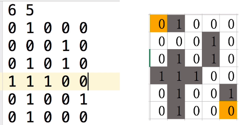
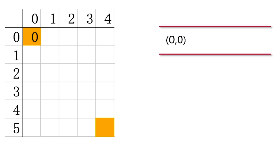
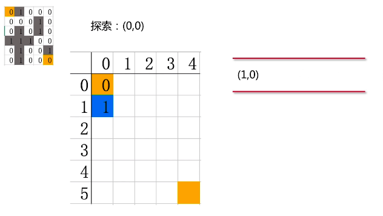
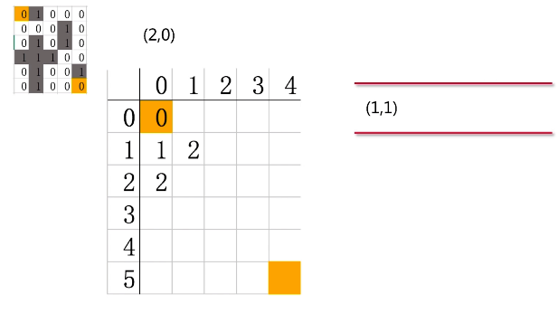
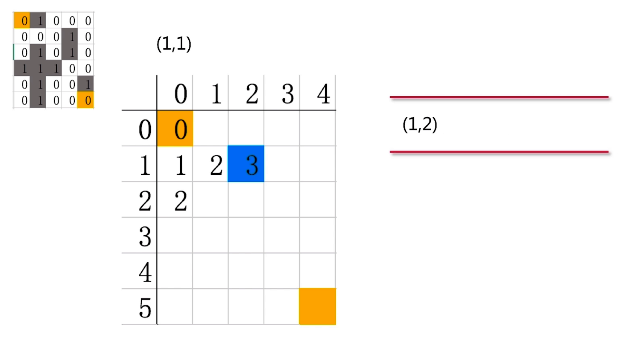

## 广度迷宫算法

广度优先搜索算法（英语：Breadth-First-Search，缩写为BFS），又译作宽度优先搜索，或横向优先搜索，是一种图形搜索算法。简单的说，BFS是从根节点开始，沿着树的宽度遍历树的节点。如果所有节点均被访问，则算法中止。广度优先搜索的实现一般采用open-closed表。

1 广度优先搜索（BFS） 
广度优先搜索依赖的是队列解决问题。队列中的每一个节点需要包含记录以下内容：该节点到起点的距离dist，该节点的前驱节点past，该节点在当前路径下是否被访问过visit（0表示没有访问过，1表示当前路径下正在访问，2表示该节点周围的所有节点都已经被访问过）。 
编程逻辑大致如下
```go
初始化：
起点值初始化（past=NULL，dist=0，visit=1）
其他节点值初始化（past=NULL，dist=无穷，visit=0）
起点入队
循环1：直到队列中没有元素
   从队伍中输出一个节点作为当前节点
   循环2：访问与当前节点连通但是【没有被访问过】的节点（visit=0的节点）
      将即将访问的节点记为正在访问的状态
      将即将访问的节点的状态更新（past=当前节点，dist=即将访问的节点到当前节点的距离，visit=1）
      即将访问的节点入队
   将当前节点的visit记为2（因为与它连接的所有节点都被访问过）

```

### 原理

>迷宫大致如下：左上角和右下角的点分别为起点和终点，灰色的点代表墙，走不通，白色的点可以走通，我们要做的是从起点走到终点，我们每到一个点便从上左下右四个方向探索它周围的四个点，如果是走过的点我们不要探索，计算出它的步数，用的广度优先算法



第一步：把起点(0,0)入队列，每次探索一个点，便把它出队列，坐标是行和列



第二步：把(0,0)出队列，开始探索(0,0)，发现只有(1,0)走得通，把(1,0)入队列，蓝色点的值代表起点走到该点的步数


第三步：把(1,0)出队列，开始探索(1,0)，发现只有(2,0)和(2,2)走得通，把它们入队列，蓝色的2代表起点走到该点的步数


第四步：把(2,0）出队列，开始探索(2,0)，发现走不通，同时不能探索走过的点，所以没有要入队列的坐标


第五步：把(1,2)出队列，开始探索(1,1)，发现只有（1,2）可以走通，把它入队列

)

```go
func readMaze(filename string)[][]int{ //查找文件函数 作用是以数组形式返回文件内容
	file, err := os.Open(filename)   //打开文件返回file指针
	if err != nil {
		panic(err)
	}
	var row, col int //定义存放行列变量
	fmt.Fscanf(file,"%d %d", &row, &col)//将文件头两个数字 也就是行列存入变量 注意是放入地址
	maze := make([][]int,row)  //开始循环创建 注意此行代码只是创建行数并没有创建列数 [][]int只是代表创建二维个数
	for i := range maze{   //找到每一行
		maze[i] = make([]int, col) //为每一行创建列数
		for j := range maze[i]{   //获得每一行的列数
			fmt.Fscanf(file,"%d",&maze[i][j])//为每一行列元素赋值 0/1
		}
	}
	return maze //将二维数组返回
}
type point struct{   //坐标结构体 尽量不用xy命名
	i, j int
}
var dirs = [4]point{ //上左下右顺序坐标点
	{-1,0},{0,-1},{1,0},{0,1},
}
func (p point)Add(r point) point{  //返回下一步的四种可能
	return point{p.i+r.i,p.j+r.j}
}
func (p point)at(grid [][]int) (int,bool){ // 判断下一步能否通过 是否越界
	if p.i < 0||p.i >= len(grid){
		return 0, false
	}
	if p.j <0 || p.j >= len(grid[p.j]){
		return 0, false
	}
	return grid[p.i][p.j], true
}
func walk(maze [][]int, start , end point)[][]int{ //整个算法核心
	steps := make([][]int, len(maze))  //创建一个存放路线的二维数组
	for i := range steps{  //同样创建列
		steps[i] = make([] int, len(maze[i]))
	}
	Q := []point{start}   //定义一个变量 及赋值变量坐标 这是算法的几个关键点之一
	for len(Q) > 0{   // 这个循环是判断我们的起点到终点能不能走通 走不通会结束循环
		cur := Q[0]   //获得当前没有用过的坐标
		Q = Q[1:]     //将上一步使用过的坐标排除 go语言的切片是不是很好用
		if cur == end{    //当坐标从0.0一步一步移动到指定结束坐标 循环结束
			break
		}
		for _, dir := range dirs{  //数组在上方定义 实际就是坐标点的上左下右 每一个坐标点都有四个方位 每次进行比较
			next := cur.Add(dir) //next装的坐标为上左下右的坐标点 next的含义是当前坐标点的下一个坐标点
			//由于我们采用的是上左下右的判断方式 越是到最后的坐标 越是最节省时间的 所以关键点在于 如果上坐标可以移动
			//下坐标也可以移动 下坐标会覆盖上坐标 因为我们是求最短路线 关键点之一
 
			val ,ok := next.at(maze)   //函数作用是判断当前坐标的下一步是否会越界及碰墙
			if !ok || val == 1{//如果会越界及碰墙则结束此次循环 说明这个坐标位置不正确
				continue
			}
			val, ok = next.at(steps) // 判断坐标点的下一步是否在走过的路线上 因为我们每走一步都会在路线上标记步数 除了第一步
			if !ok || val != 0{
				continue
			}
			if  next == start{ //这就是判断第二步是否掉回头到第一步的作用 补充第一个判断的
				continue
			}
			cursteps, _ := cur.at(steps)  //将当前坐标的步数返回给变量
			steps[next.i][next.j] = cursteps+1 //确定下一步的坐标并且让步数加一
 
			Q = append(Q,next) //将下一步的位置传给变量  关键点之一 如果上左下右没有一个地方可以通过 变量的长度为零 循环结束
		}
	}
	return steps
}
func main() {
	maze := readMaze("maze/maze.in")  //函数作用很简单 找到目标文件并将文件内容存到二维数组然后返回给maze
	//函数作用是将迷宫路线以二维数组方式返回 第一个参数是将迷宫传入 第二个参数 确定起始位置 第三个参数 确定结束位置
	steps := walk(maze, point{0,0}, point{len(maze)-1,len(maze[0])-1})
	//打印路线
	for _,row := range steps{
		for _, val := range row{
			fmt.Printf("%3d", val)
		}
		fmt.Println()
	}
}
```

### 总结
- 用循环创建二维slice

- 用slice实现队列

- 用Fscanf读取文件

- 对Point的抽象(struct)