# 变量

> 不论是使用哪种高级程序语言编写程序,变量都是其程序的基本组成单位

```go
package main

import "fmt"

func getVal(num1 int,num2 int)(int,int){
	 sum :=num1+num2
	 sub :=num2-num1
	 return sum,sub
}

func main(){

	sum,sub:=getVal(30,30)
	fmt.Println("sum=",sum,"sub=",sub)
	sum2,_:=getVal(10,30)
	fmt.Println("sum=",sum2)
}
```
比如上图的 sum,sub 都是变量

## 变量的概念

 变量相当于内存中一个数据存储空间的表示，你可以把变量看做是一个房间的门 牌号，通过门牌号我们可以找到房间，同样的道理，通过变量名可以访问到变量 (值)。
 
 
 
## 变量的使用步骤

 - 声明变量(也叫:定义变量)
 - 非变量赋值
 - 使用变量

## 案例

```go
    // 定义变量 声明变量
	var i int
	
	// 给i赋值
	i=10
    
	// 使用变量
	fmt.Println("i=",i)
```

## 变量使用注意事项

 - 变量表示内存中的一个存储区域
 - 该区域有自己的名称(变量名)和类型(数据类型)
 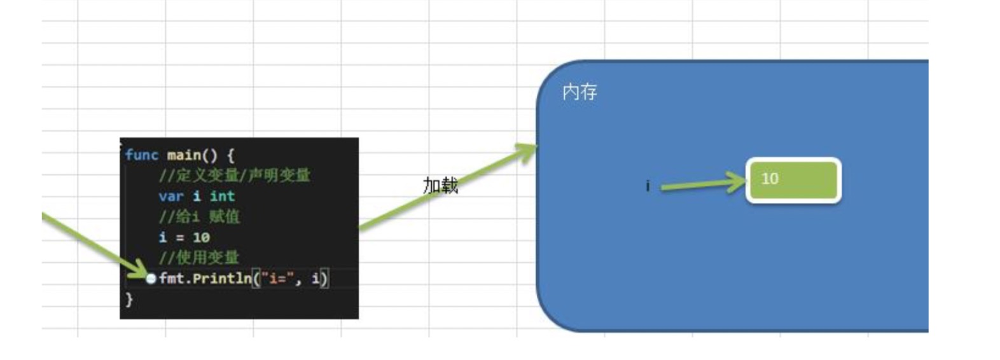
 - Golang变量使用的三种方式
 
 1.第一种:指定变量类型，声明后若不赋值，使用默认值
 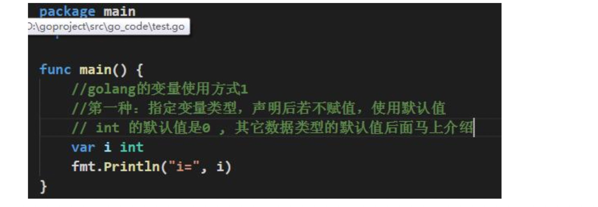
 2.第二种:根据值自行判定变量类型(类型推导)
 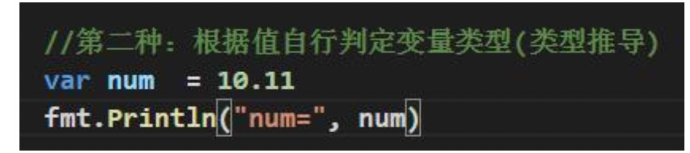
 3.第三种:省略 var, 注意 :=左侧的变量不应该是已经声明过的，否则会导致编译错误
 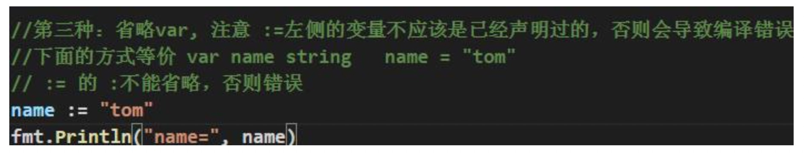
 4.多变量声明:在编程中，有时我们需要一次性声明多个变量，Golang 也提供这样的语法
 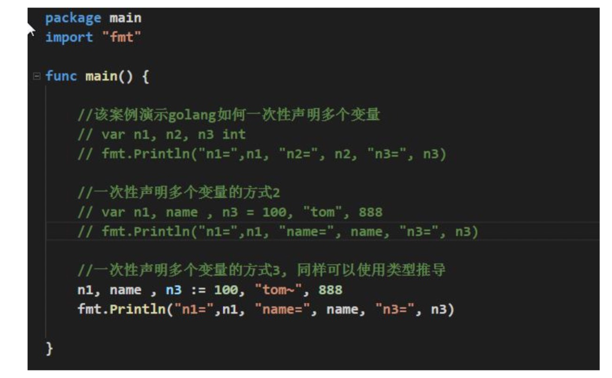
 如何一次性声明多个全局变量【在 go 中函数外部定义变量就是全局变量】:
 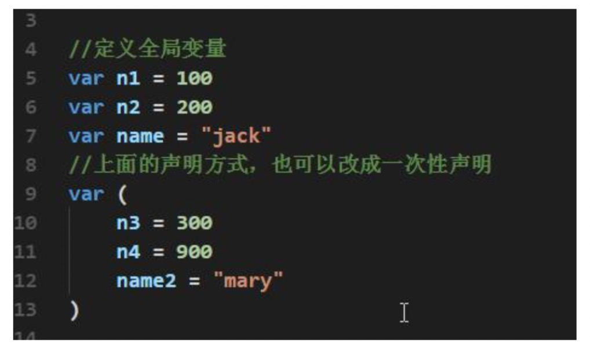
 5.该区域的数据值可以在同一类型范围内不断变化(重点)
 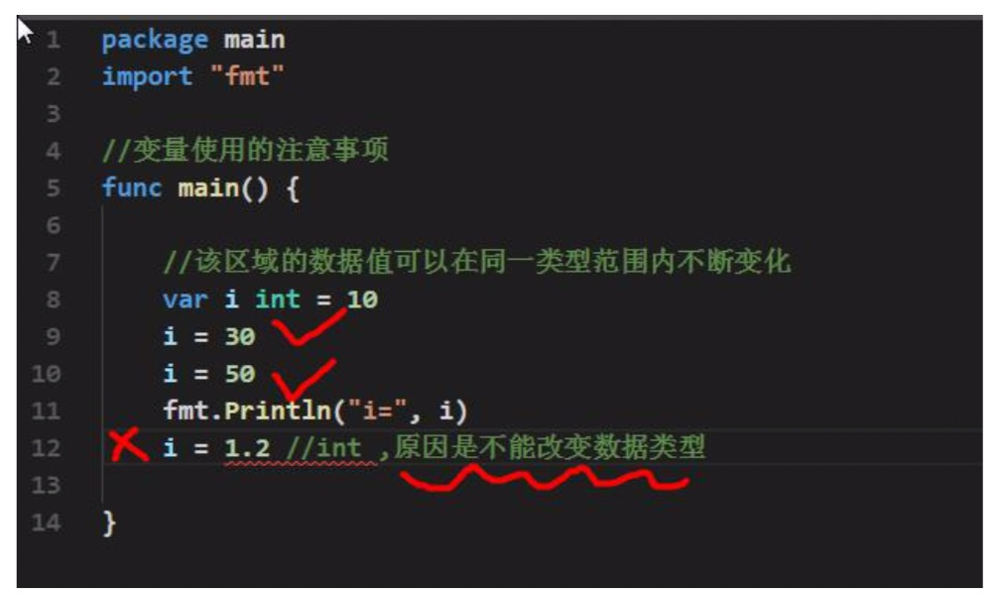
 6.变量在同一个作用域(在一个函数或者在代码块)内不能重名
 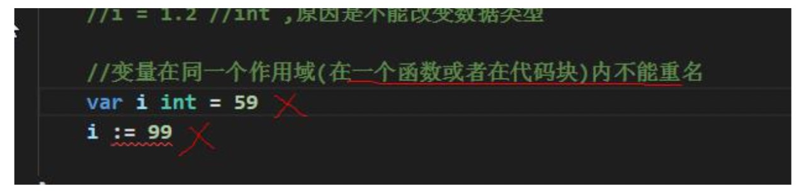
 7.变量=变量名+值+数据类型，这一点请大家注意，变量的三要素
 
 8.Golang 的变量如果没有赋初值，编译器会使用默认值, 比如 int 默认值 0 小数默认为 0
 
 ## 变量的声明，初始化和赋值
 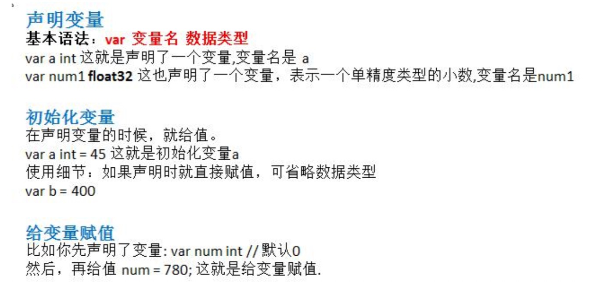
 
 
 ## 程序中 +号的使用
 
 - 当左右两边都是数值型时，则做加法运算
 - 当左右两边都是字符串，则做字符串拼接
 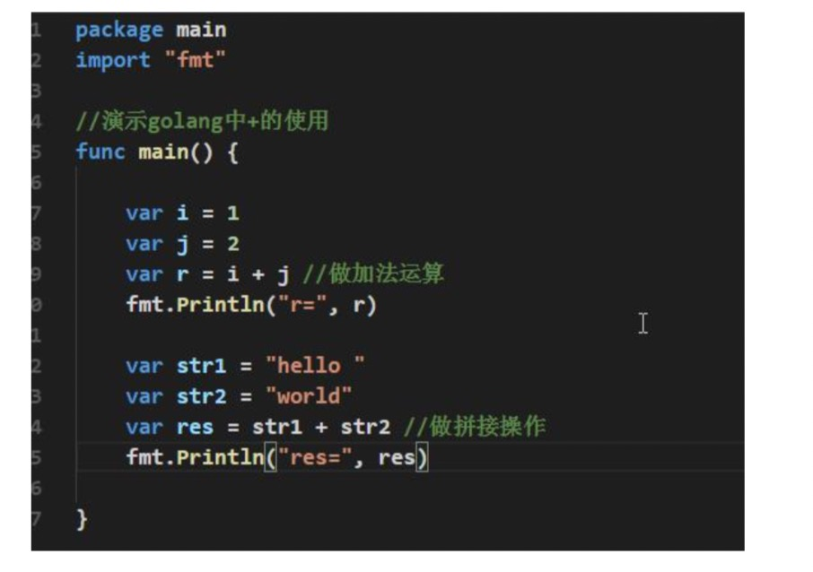
 
 
 ## 数据类型的基本介绍
 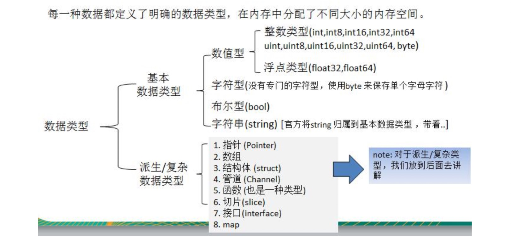