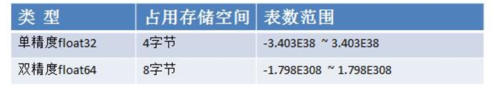

# 小数类型/浮点型

## 基本介绍
> 小数类型就是用于存放小数的，比如 1.2 0.23 -1.911
```go
package main
import (
	"fmt"
	"unsafe"
)

//演示golang中小数类型使用
func main() {
	
	var price float32 = 89.12
	fmt.Println("price=", price)
	}
```

## 小数类型分类
)
- 关于浮点数在机器中存放形式的简单说明,浮点数=符号位+指数位+尾数位

1.说明:浮点数都是有符号的
```go
package main
import (
	"fmt"
	"unsafe"
)

//演示golang中小数类型使用
func main() {
	
	var price float32 = 89.12
	fmt.Println("price=", price)
	var num1 float32 = -0.00089
	var num2 float64 = -7809656.09
	fmt.Println("num1=", num1, "num2=", num2)
```

- 尾数部分可能丢失，造成精度损失。 -123.0000901
```go

	//尾数部分可能丢失，造成精度损失。 -123.0000901
	var num3 float32 = -123.0000901
	var num4 float64 = -123.0000901
	fmt.Println("num3=", num3, "num4=", num4)
```

1.说明:float64 的精度比 float32 的要准确
2.说明:如果我们要保存一个精度高的数，则应该选用 float64

- 浮点型的存储分为三部分:符号位+指数位+尾数位 在存储过程中，精度会有丢失

## 浮点型使用细节

- Golang浮点类型有固定的范围和字段，不受具体OS(操作系统)的影响
- Golang 的浮点型默认声明为 float64 类型。
```go
//Golang 的浮点型默认声明为float64 类型
	var num5 = 1.1
	fmt.Printf("num5的数据类型是 %T \n", num5)
```
- 浮点型常量有两种表示形式
1.十进制数形式:如:5.12 .512 (必须有小数点)
2.科学计数法形式:如:5.1234e2 = 5.12 * 10 的 2 次方 5.12E-2 = 5.12/10 的 2 次方
```go

	//十进制数形式：如：5.12       .512   (必须有小数点）
	num6 := 5.12
	num7 := .123 //=> 0.123
	fmt.Println("num6=", num6, "num7=", num7)

	//科学计数法形式
	num8 := 5.1234e2 // ? 5.1234 * 10的2次方
	num9 := 5.1234E2 // ? 5.1234 * 10的2次方 shift+alt+向下的箭头
	num10 := 5.1234E-2 // ? 5.1234 / 10的2次方 0.051234
```
- 通常情况下，应该使用 float64 ，因为它比 float32 更精确。[开发中，推荐使用 float64]