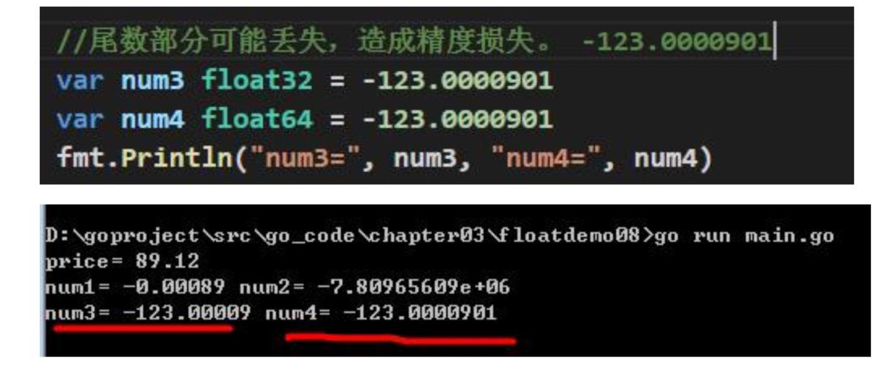

# 小数类型/浮点型

## 基本介绍
> 小数类型就是用于存放小数的，比如 1.2 0.23 -1.911
)
- 关于浮点数在机器中存放形式的简单说明,浮点数=符号位+指数位+尾数位

  1.说明:浮点数都是有符号的

- 尾数部分可能丢失，造成精度损失。 -123.0000901

1.说明:float64 的精度比 float32 的要准确
2.说明:如果我们要保存一个精度高的数，则应该选用 float64

- 浮点型的存储分为三部分:符号位+指数位+尾数位 在存储过程中，精度会有丢失