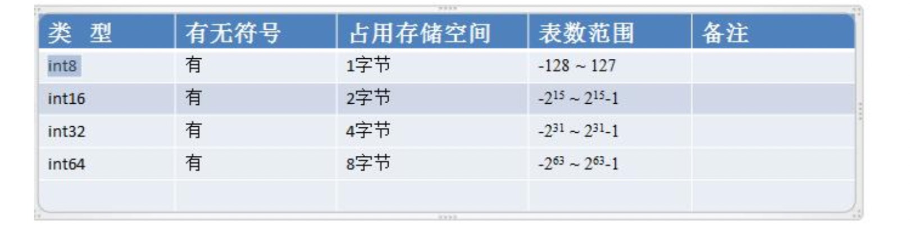
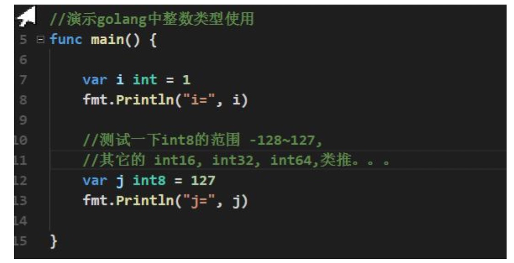
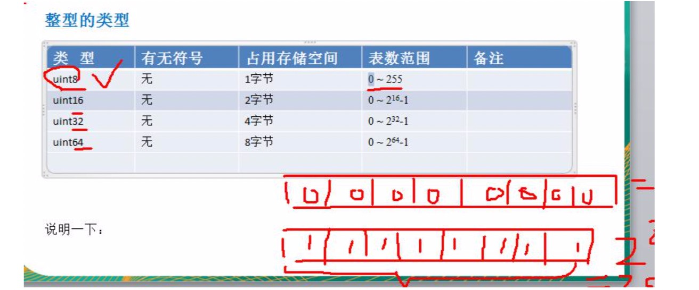
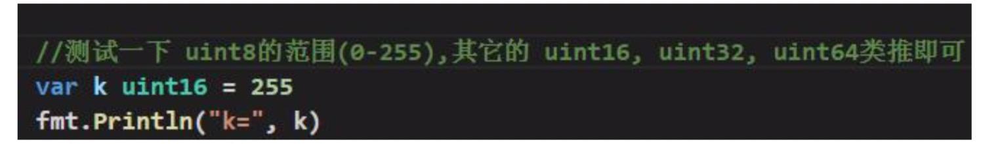
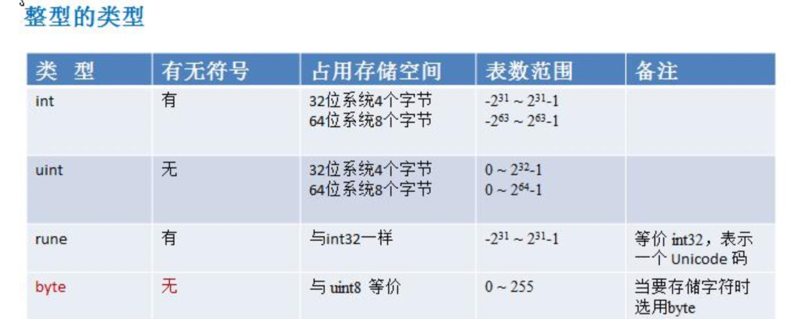
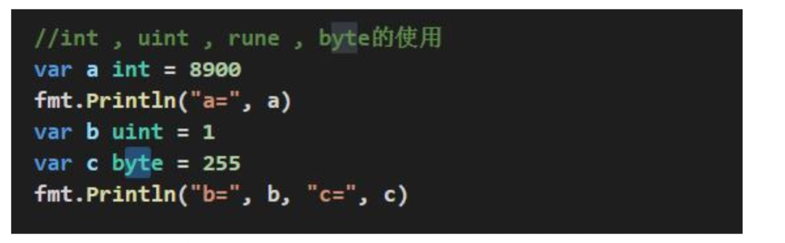
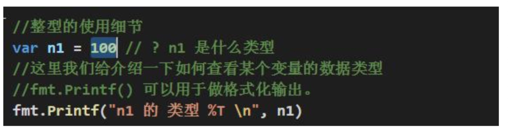
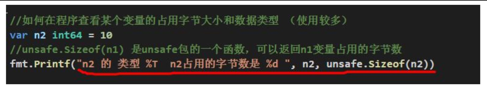
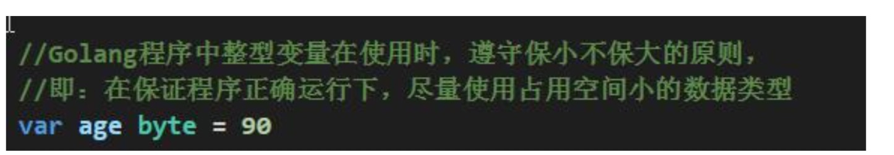

# 整数类型

## 基本介绍

  简单的说，就是用于存放整数值的，比如 0, -1, 2345 等等。
  
  
## 整数的各个类型

- int 的无符号的类型 (静态类型unsign)

- int 的其它类型的说明:

## 整型的使用细节

- Golang 各整数类型分:有符号和无符号，int uint 的大小和系统有关。
- Golang 的整型默认声明为 int 型

- 如何在程序查看某个变量的字节大小和数据类型 (使用较多)

- Golang程序中整型变量在使用时，遵守保小不保大的原则，即:在保证程序正确运行下，尽量 使用占用空间小的数据类型。【如:年龄】

- bit: 计算机中的最小存储单位。byte:计算机中基本存储单元。[二进制再详细说] 1byte = 8 bit