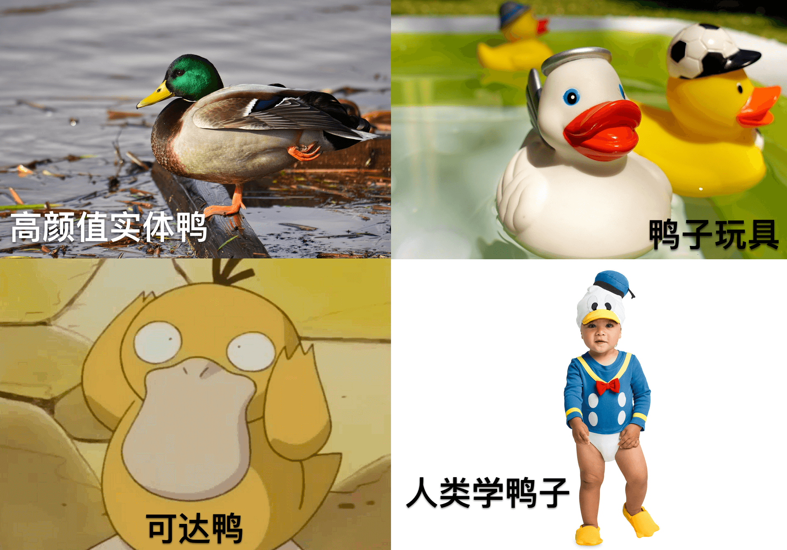

# go基础学习笔记

Go 语言也提供了接口类型，使得我们可以面向接口编程，将实现和接口分离。在我看来，软件的抽象之美也应该以此来表达，和 Java 语言不同的是 Go 并不是那么 “强制”，它使用了一种 鸭子类型 的方式让动态类型成为可能。


# duck typing

在 Go 中没有 **implements** 和 **extends** 这种关键字，这对我们而言反倒轻松了一些，它认为 Go 的接口就像鸭子测试里的描述：

> 当看到一只鸟走起来像鸭子、游泳起来像鸭子、叫起来也像鸭子，那么这只鸟就可以被称为鸭子。

在鸭子类型中，关注点在于对象的行为，能作什么；而不是关注对象所属的类型。例如，在不使用鸭子类型的语言中，我们可以编写一个函数，它接受一个类型为 “鸭子” 的对象，并调用它的 “走” 和 “叫” 方法。

在使用鸭子类型的语言中，这样的一个函数可以接受一个任意类型的对象，并调用它的 “走” 和 “叫” 方法。如果这些需要被调用的方法不存在，那么将引发一个运行时错误。

任何拥有这样的正确的 “走” 和 “叫” 方法的对象都可被函数接受的这种行为引出了以上表述，这种决定类型的方式因此得名。


## 举个例子

我们用 Go 语言来实现一个鸭子类型：


```go
  type Duck interface {
      Swim()    // 游泳
      Feathers() // 羽毛
  }
```

这里使用 Go 提供的 interface 关键字定义了一个鸭子接口类型，这个接口中提供了鸭子的两种行为：游泳和羽毛是什么样的，但是没有提供实现。

我们见过的鸭子类型可多了去了，下面是你可能见过的：




## 组合接口

现在我们给鸭子再添加一种嘎嘎叫的能力，一种方式是在原有的接口上添加 “嘎嘎叫” 方法，这样做的话就表示所有的鸭子都应该拥有此能力，假设我们的玩具鸭并不能开口嘎嘎叫，所以它没有这种能力。这时候我们可以将会嘎嘎叫的鸭子单独定义一种类型，在 Go 可以使用组合的方式来实现：
```go
type QuackDuck interface {
    Quack()  // 嘎嘎叫
    Duck     // 嵌入接口
}
```
这样 QuackDuck 类型就拥有了之前 Duck 提供的两种抽象能力，同时还应该拥有嘎嘎叫的能力。

## 接口实现

前面我们只给出了鸭子的能力定义，还没有任何实现，由于 Go 中没有继承和实现的关键字，想成为上述接口的实现非常简单，只要实现它们定义的方法就可以了。

```go
// RealDuck - 真正的鸭子
type RealDuck struct { }

func (RealDuck) Swim() {
    fmt.Println("用鸭璞向后划水")
}

func (RealDuck) Feathers() {
    fmt.Println("遇到水也不会湿的羽毛")
}

func (RealDuck) Quack() {
    fmt.Println("嘎~ 嘎~ 嘎~")
}

// ToyDuck - 玩具鸭
type ToyDuck struct { }

func (ToyDuck) Swim() {
    fmt.Println("以固定的速度向前移动")
}

func (ToyDuck) Feathers() {
    fmt.Println("白色的固定的塑料羽毛")
}
```
可以看到我们定义了两种鸭子类型，一种是真正的鸭子，它还多实现了一种嘎嘎叫方法，另一个玩具鸭子只有游泳和羽毛这两种行为。

这个编程方式和我们写普通的结构体方法没什么区别，只是对应的方法签名相同，其实这种方式在 Go 语言的标准库中有特别多的应用，比如：io.Reader、io.Writer 和 io.Closer。


## 接口使用
```go
var duck Duck
duck = ToyDuck{}
duck.Swim()
duck.Feathers()

以固定的速度向前移动
白色的固定的塑料羽毛
```

## 总结

- 首先 interface 是一种类型，从它的定义可以看出来用了 type 关键字，更准确的说 interface 是一种具有一组方法的类型，这些方法定义了 interface 的行为。
- 接口定义也就是使用者可以按照自己所需要的场景去设计，实现者只要实现对应的方法就行，不管它是什么类型的
- 接口赋值需要注意的是实现者一定得有实现接口所需要的方法
- interface（接口） 变量存储的是实现者的值


### https://sanyuesha.com/2017/10/18/go-interface-3/